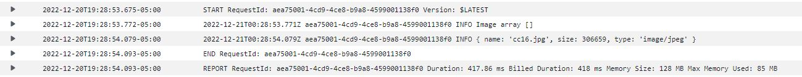

# image-lambda

## how to use

Upload a jpg image to my lab-17-sethpp S3 bucket
Event trigger will trigger lambda function to update .json file with the new image in the array.

## Problems Occured

I couldn't get the test environment to successfully mimic an event where I upload an image, got errors saying access denied but when I uploaded an image it would update the .json

## Links and pictures

<https://lab-17-sethpp.s3.us-east-2.amazonaws.com/images.json>

